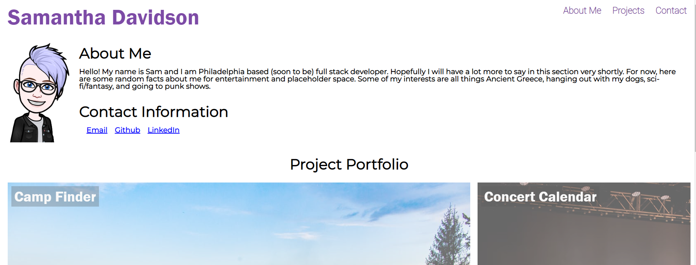

# Professional Portfolio

## Description 
The goal of this project was to was to create a professional portfolio website. This site contains information about me, including a brief description of my interests, contact information, and links to projects that I have worked on. This site is designed to work on multiple screen sizes. Technology used was HTML and CSS.

## Site Image

To visit the site click [here](https://samanthajanedavidson.github.io/Code-Refactor/#social-media-marketing). 

## License
Please refer to the license in the repo. 